# Getting Started

*Set up everything for the workshop in about 10 minutes, then run your first
simulation.*

You need a laptop with an up-to-date web browser (Chrome, Edge or Firefox)
and an internet connection. You don't need to install any software or buy
any hardware. Everything runs in your browser.

In every picture below, a **red outline** marks the thing to click.

---

## Step 1: Create your Wokwi account

Wokwi is the free online simulator you'll build all the circuits in. It
works like an electronics workbench inside your browser: you add parts, wire
them up, load the code and press Play.

1. Go to [wokwi.com/projects/new/esp32](https://wokwi.com/projects/new/esp32)
   and click **SIGN IN** at the top right. The same button works whether or
   not you already have an account.

   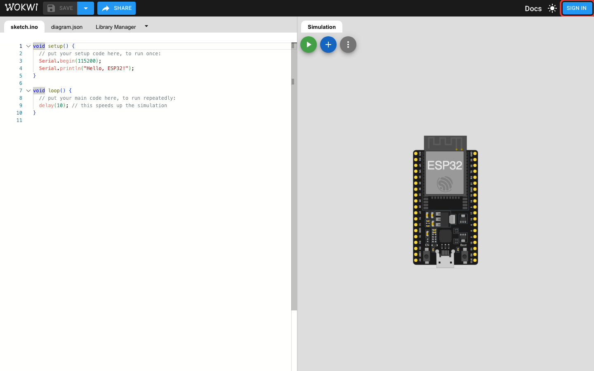

2. Choose **Continue with Google**, **Continue with GitHub** or **Continue
   with Email**. If you choose email, Wokwi sends you a sign-in link. Open
   it in the same browser.

   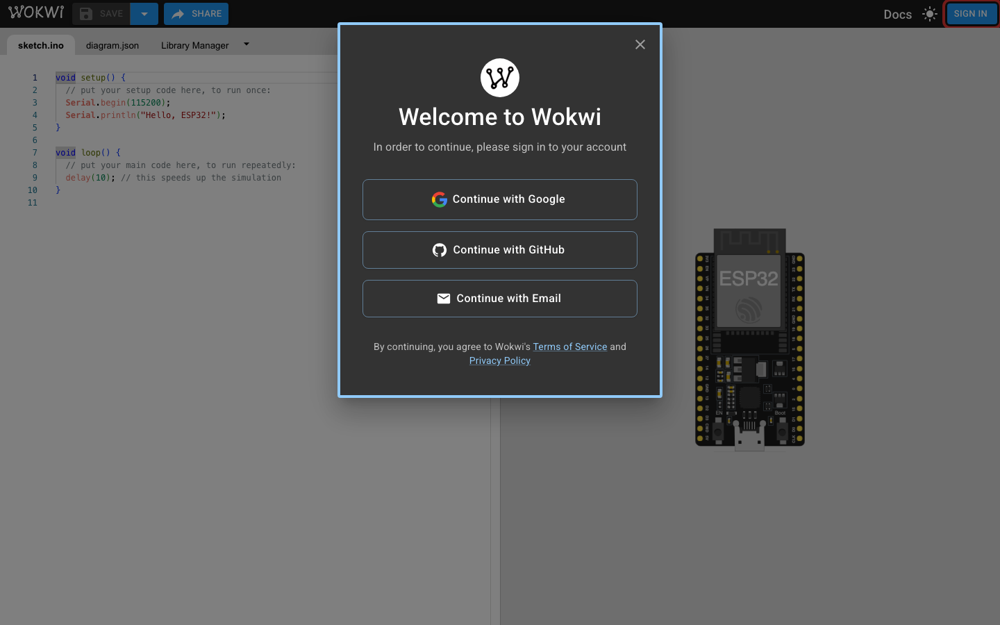

That's it. Your Wokwi account is ready, and Wokwi can now save your projects.

## Step 2: Create your ThingSpeak account

ThingSpeak is a free cloud service that stores your device's readings and
draws them as live charts. You need it from Lab 4 onwards. ThingSpeak is run
by a company called MathWorks, so you sign in with a free MathWorks account.

1. Go to [thingspeak.com](https://thingspeak.com) and click **Sign In**.

   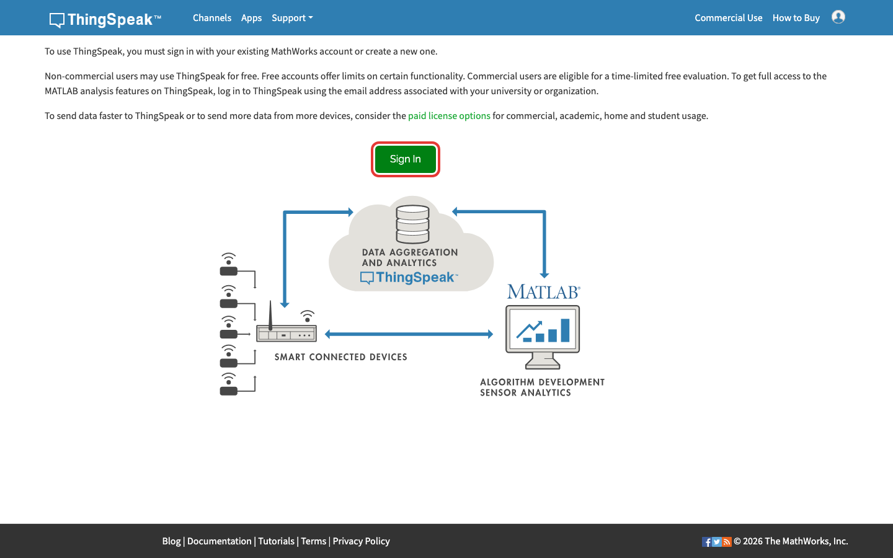

2. On the MathWorks page, click **Create Account**.

   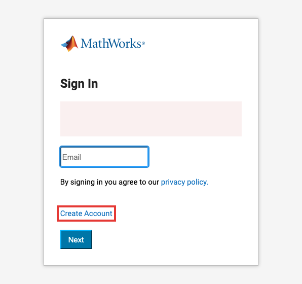

3. Fill in the short form: your email address, where you live, and your
   name. MathWorks sends a message to your email address. Open it and click
   the link to confirm your account, then choose a password.

4. Go back to [thingspeak.com](https://thingspeak.com), click **Sign In**
   again and sign in with your new account. If ThingSpeak asks what you'll
   use it for, choose the option for personal, student or non-commercial
   use. The free plan is all you need.

## Step 3: Run your first simulation

Every lab starts the same way. Try it once now, so the labs go smoothly.
The pictures use Lab 2's files: you'll find them in
[2-labs/lab-2-temperature-and-humidity](../2-labs/lab-2-temperature-and-humidity/).

1. **Open a new project.** Go to
   [wokwi.com/projects/new/esp32](https://wokwi.com/projects/new/esp32).
   You get a blank project with two files: **sketch.ino**, the code that runs
   on the ESP32, and **diagram.json**, a description of the circuit.

   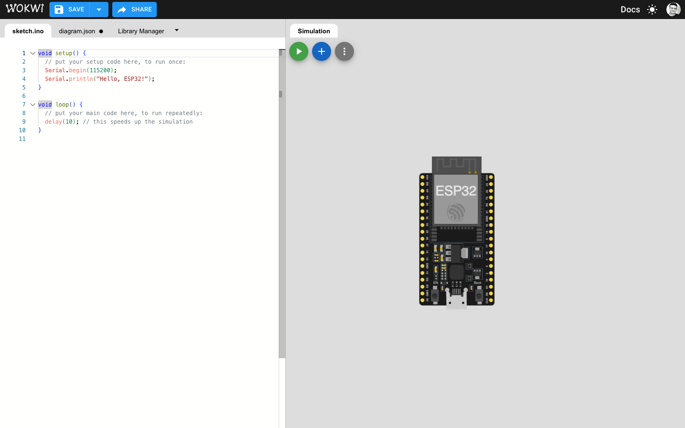

2. **Paste the code.** Open the lab's `sketch.ino` and copy all of it. In
   Wokwi, click into the **sketch.ino** tab, select all the code that's
   already there (`Ctrl+A`, or `Cmd+A` on a Mac), and paste over it.

   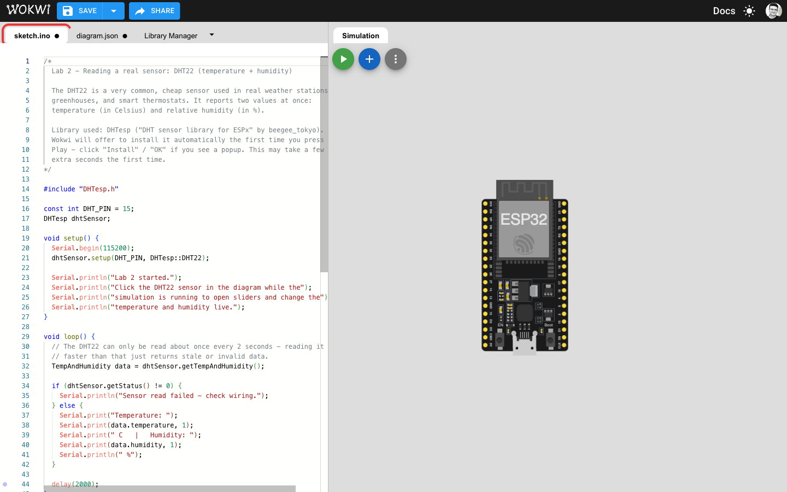

3. **Paste the circuit.** Click the **diagram.json** tab.

   

   Copy all of the lab's `diagram.json`, select all in Wokwi's diagram.json
   tab, and paste over it. The circuit on the right changes straight away.

   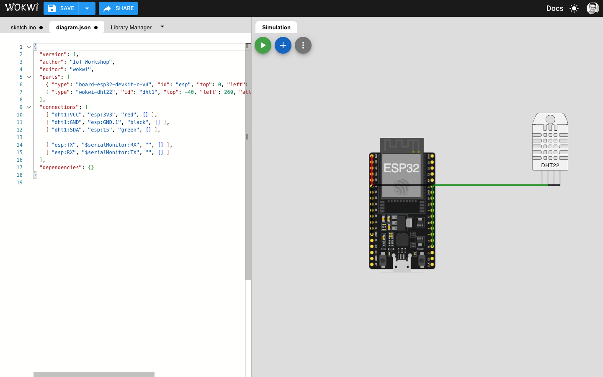

4. **Add the library list, if the lab has one.** Some labs have a file
   called `libraries.txt`. It tells Wokwi which extra code packages to
   install. Lab 1 doesn't need one; Labs 2 to 6 do.

   a. Click the small **▾** next to the **Library Manager** tab.

   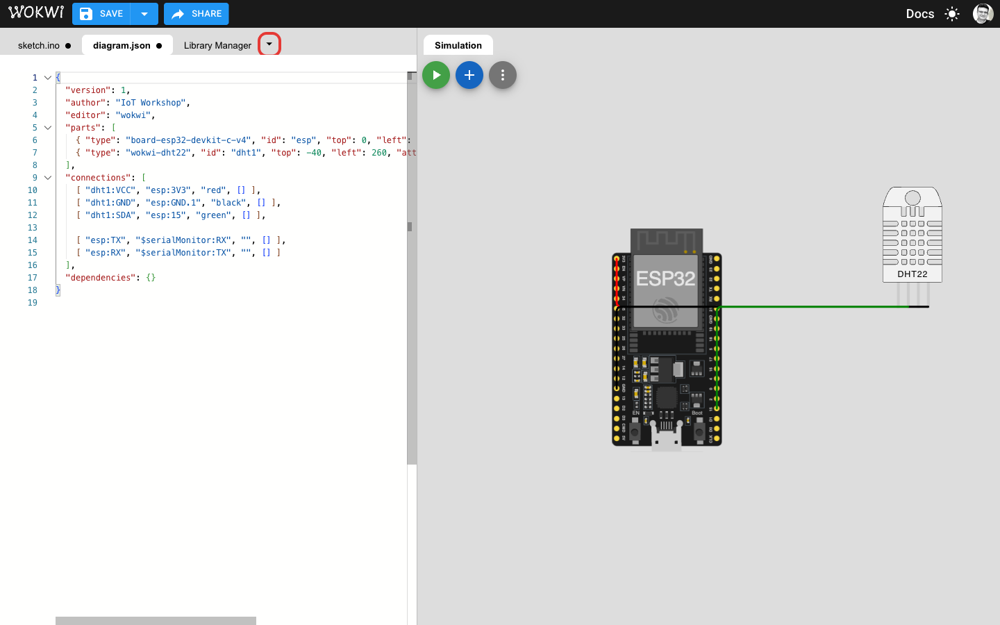

   b. Choose **New file...**.

   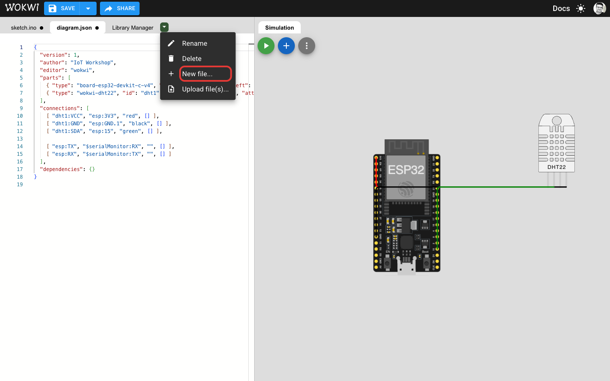

   c. Type the name exactly `libraries.txt` and click **CREATE**.

   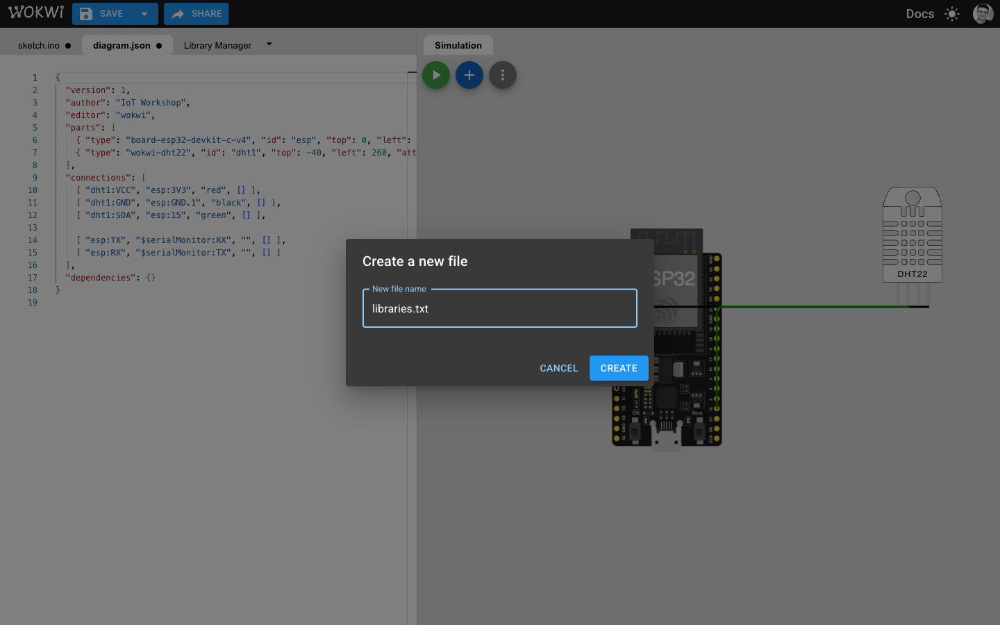

   d. Paste the contents of the lab's `libraries.txt` into the new tab.

   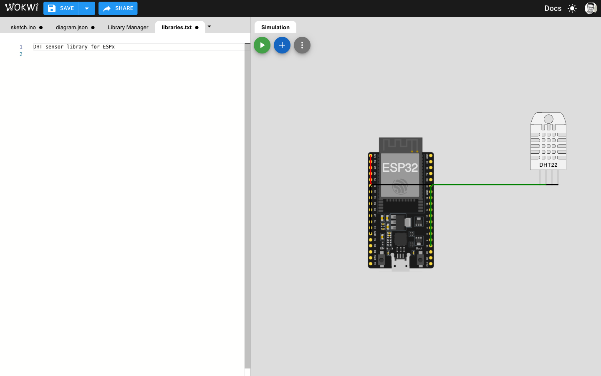

5. **Press Play.** Click the green **▶** button at the top left of the
   circuit area. Wokwi now builds your code, which takes a few seconds.

   

6. **Watch it run.** A **Serial Monitor** appears at the bottom of the
   circuit area. This is where the device prints its messages and readings.

   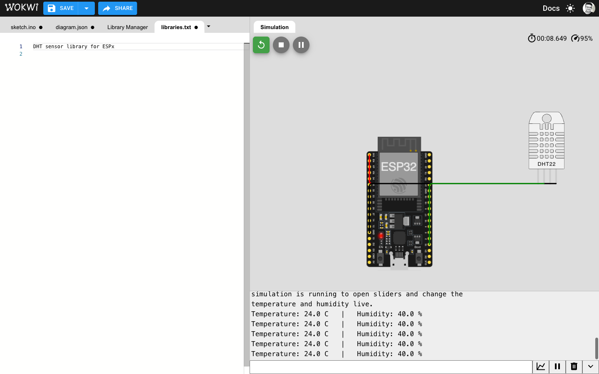

Well done! You've just run a real program on a simulated ESP32.

---

## Good to know

- **The first build can be slow.** A lab with extra libraries can take a
  minute or two. If you see **"Build Servers Busy"**, wait a moment and
  press Play again. Nothing is wrong with your code.
- **If you see "Build failed!"**, read the first red line. It usually names
  the problem. The most common cause is a missing `libraries.txt`.
- **You can play with the parts while the simulation runs.** Press buttons,
  turn dials, and click the temperature sensor to change the temperature
  and humidity.
- **Save your work** with the **SAVE** button at the top. To send your
  project to someone, use **SHARE** and copy the link.
- **The Wi-Fi network is called `Wokwi-GUEST`** and has no password. It
  gives your simulated device a real internet connection, which Labs 3 to 6
  use. The code already has these settings.
- **HiveMQ**, used in Labs 3 and 6 to watch your data arrive, needs no
  account. The lab guides show you how to open it.

## Next step

Start with [Lab 1: Digital vs Analog](../2-labs/lab-1-digital-vs-analog/).
